# Mermaid.js Complete Syntax Reference

BEFORE generating any diagram, load this skill by calling `skill("mermaid")` to inject this syntax reference into context. Use this guide to generate **valid Mermaid.js diagrams** that render correctly via the Kroki API. Every syntax example below is tested and verified.

## CRITICAL RULES

1. **Output valid Mermaid inside ````mermaid ... ```` fenced code blocks only.** Never output raw Mermaid syntax without the fence.
2. **The first line INSIDE the fence must be the diagram type keyword** (e.g., `graph TD`, `sequenceDiagram`, `mindmap`, `classDiagram`, `gitgraph`, `stateDiagram`, `erDiagram`, `gantt`, `pie`, `timeline`).
3. **Never use the word "end" in lowercase as a node label** — it breaks parsing. Use "End" or "END" instead.
4. **Never start a link with lowercase "o" or "x"** — they create circle/cross edges. Prefix with a space: `A--- oB` becomes a circle edge.
5. **Indentation matters for mindmaps** — use consistent indentation (2 or 4 spaces).
6. **Comments** start with `%%` on their own line. Use them to annotate complex diagrams.
7. **Test every diagram mentally** — if it's complex, start simple and layer nodes/edges.

---

## 1. FLOWCHARTS (graph / flowchart)

### Direction
```mermaid
graph TD    # Top to Bottom (same as TB)
graph LR    # Left to Right
graph BT    # Bottom to Top
graph RL    # Right to Left
```

### Node Shapes
```
A[rect]              # Rectangle (default)
A(round)             # Rounded corners
A([stadium])         # Stadium/pill shape
A[[subroutine]]      # Subroutine (double brackets)
A[(database)]        # Cylinder/database shape
A((circle))          # Circle
A>asymmetric]        # Asymmetric shape
A{diamond}           # Diamond/decision
A{{hexagon}}         # Hexagon
A[/parallelogram/]   # Parallelogram (lean right)
A[\\parallelogram alt\\]  # Parallelogram (lean left)
A[/trapezoid\\]      # Trapezoid
A[\\trapezoid alt/]  # Trapezoid alt
A(((double circle))) # Double circle
```

### New Shape Syntax (v11.3.0+) — Use for special shapes
```
A@{ shape: rect }        # Rectangle (same as A[text])
A@{ shape: stadium }     # Pill shape
A@{ shape: diamond }     # Decision
A@{ shape: circle }      # Circle
A@{ shape: hexagon }     # Hexagon
A@{ shape: cylinder }    # Database
A@{ shape: doc }         # Document
A@{ shape: cloud }       # Cloud
A@{ shape: bang }        # Bang/exclamation
A@{ shape: flag }        # Flag/paper tape
A@{ shape: hourglass }   # Collate
A@{ shape: bolt }        # Lightning bolt / com link
A@{ shape: brace }       # Curly brace comment
A@{ shape: divide }      # Fork/join rectangle
A@{ shape: subroutine }  # Framed rectangle
```

### Edges (Links)
```
A-->B                    # Arrow
A---B                    # Line (no arrow)
A-- text ---B            # Line with text
A-- text -->B            # Arrow with text
A-.->B                   # Dotted arrow
A-. text .->B            # Dotted arrow with text
A==>B                    # Thick arrow
A== text ==>B            # Thick arrow with text
A-->|text|B              # Arrow with text (alt syntax)
A---oB                   # Circle at end (use space before o)
A---xB                   # Cross at end (use space before x)
A<-->B                   # Bidirectional arrow
A<==>B                   # Bidirectional thick arrow
A-. text .->B            # Dotted with label
```

### Multi-directional arrows
```
A--oB                    # Circle at end
A--xB                    # Cross at end
o--oA                    # Circle at both ends
<-->B                    # Bidirectional
```

### Subgraphs
```
subgraph Title
  A-->B
  B-->C
end

subgraph sg1[Custom Label]
  direction LR          # Override direction inside subgraph
  A-->B
end
```

### Styling
```
style A fill:#f9f,stroke:#333,stroke-width:4px,color:red
style B fill:#bbf,stroke:#f66,stroke-width:2px,color:#fff,stroke-dasharray: 5 5
linkStyle 0 stroke:#ff3,stroke-width:2px
classDef className fill:#f9f,stroke:#333,stroke-width:4px;
class A,B className;    # Apply class to nodes
A:::className           # Apply inline class
classDef default fill:#f9f,stroke:#333;  # Default style for all nodes
```

### Multi-line text in nodes
```
A["Line 1<br/>Line 2"]  # HTML line break
A["`Line 1<br/>Line 2`"] # Markdown string (auto-wraps)
```

### Example — Complete Flowchart
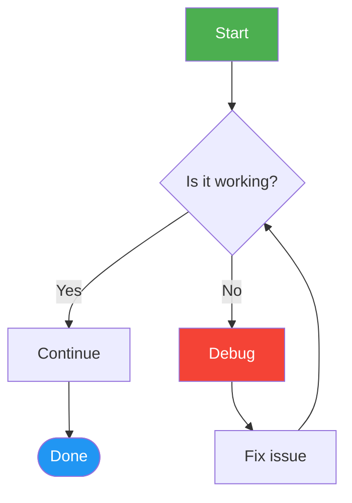

### Educational Flowchart Examples

#### Physics problem-solving flowchart
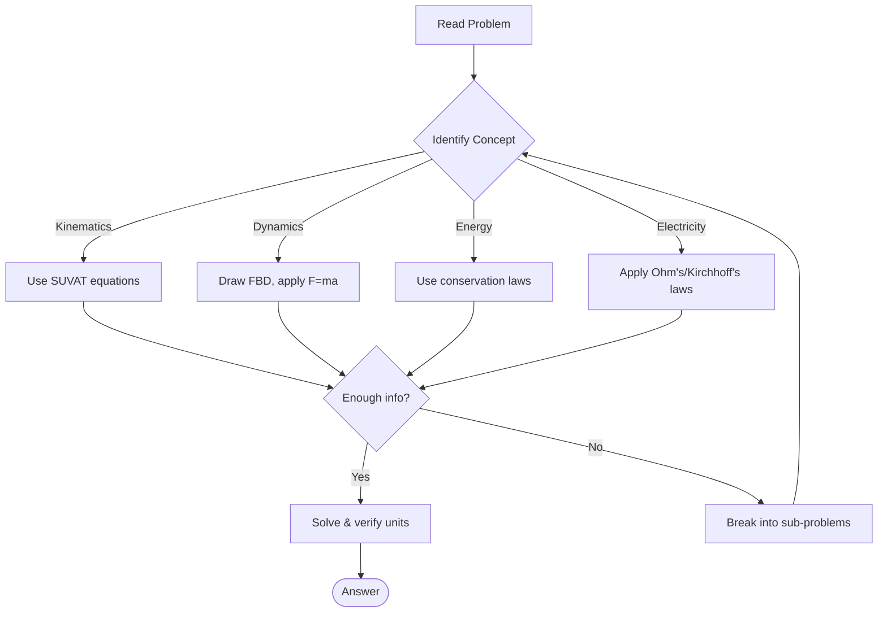

#### Chemical reaction types
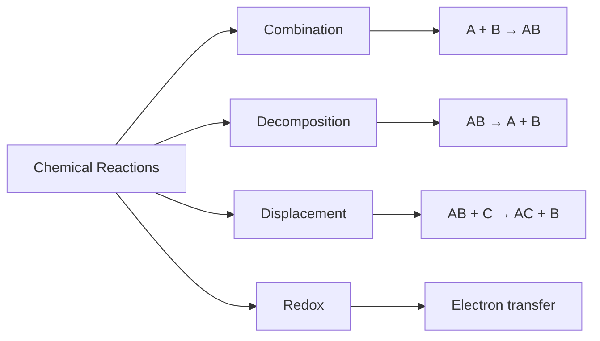

---

## 2. SEQUENCE DIAGRAMS

### Basic Syntax
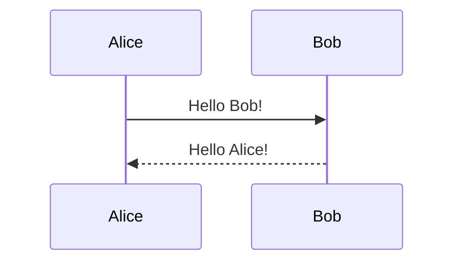

### Participant Types
```
participant A             # Rectangle box
actor A                   # Stick figure icon
participant A as Label    # Custom label
actor A as Label          # Actor with custom label
participant A <<boundary>>   # Boundary icon
participant A <<control>>    # Control icon
participant A <<entity>>     # Entity icon
participant A <<database>>   # Database icon
```

### Arrow Types
```
->>       # Solid arrow (message)
-->>      # Dotted arrow (response)
-x        # Solid with cross
--x       # Dotted with cross
-)        # Solid with open arrow (async)
--)       # Dotted with open arrow (async)
<<->>     # Bidirectional solid
<<-->>    # Bidirectional dotted
```

### Activation Boxes
```
activate Alice
Alice->>Bob: Query
deactivate Bob
```
Shortcut: `Alice->>+Bob: Query` (auto-activate), `Bob-->>-Alice: Response` (auto-deactivate)

### Boxes (Grouping)
```
box Blue Team
participant A
participant B
end
box rgb(33,66,99)
participant C
end
```

### Loops, Conditions, Parallel
```
loop Every minute
  A->>B: Check status
end

alt Success
  A->>B: OK
else Failure
  A->>B: Error
end

opt Optional step
  A->>B: Maybe
end

par Parallel actions
  A->>B: Action 1
and
  A->>C: Action 2
end

break Error occurs
  A->>B: Handle error
end

critical Must complete
  A->>B: Critical step
option Timeout
  A->>B: Fallback
end
```

### Notes
```
Note right of A: Text note
Note left of A: Text note
Note over A,B: Spanning note
```

### Background Highlighting
```
rect rgb(191, 223, 255)
  A->>B: Important flow
end
```

### Example — Complete Sequence Diagram
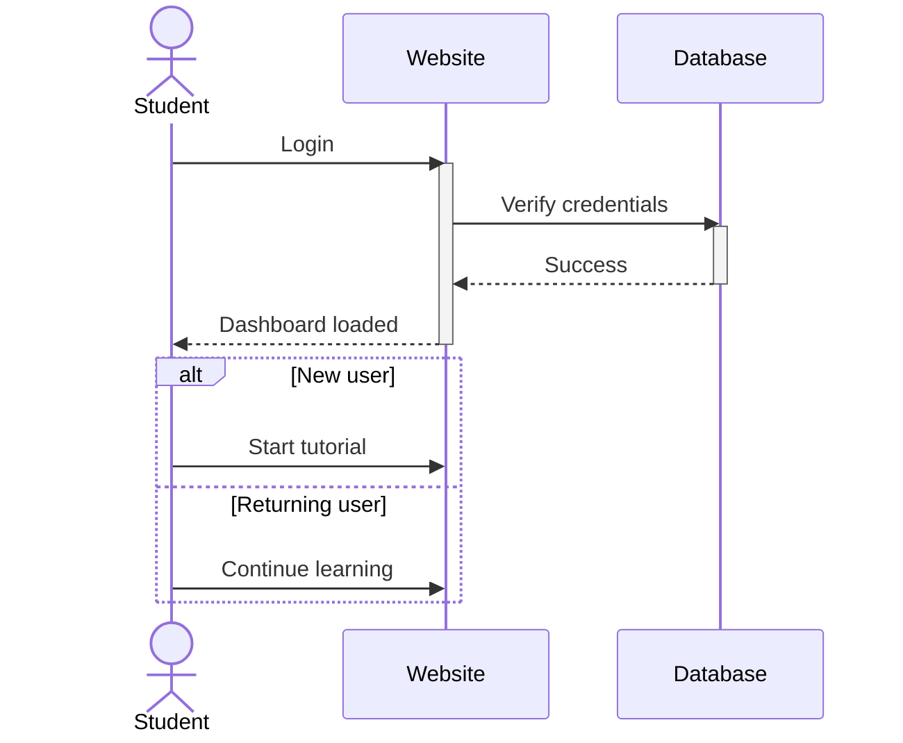

---

## 3. MINDMAPS

### Basic Structure (indentation-based)
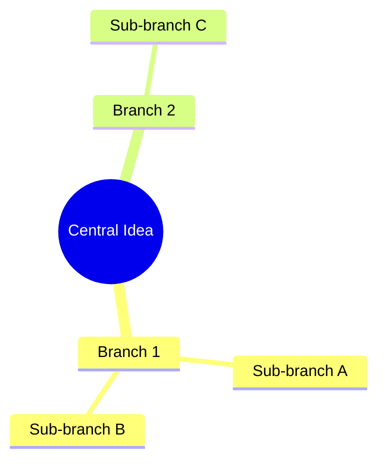

### Node Shapes
```
root[Square]                    # Square brackets
root(Rounded square)            # Rounded (parentheses)
root((Circle))                  # Double parentheses
root([Stadium])                 # Stadium/pill
root[[Bang]]                    # Double square
root{{Hexagon}}                 # Curly braces
root{Cloud}                     # Cloud (curly braces)
root)Default(               # Default (single parenthesis)
```

### Indentation Rules
- The root node starts at column 0 (leftmost).
- Child nodes are indented further than their parent.
- Siblings have the SAME indentation level.
- Grandchildren are indented further than children.
- Use 2-space or 4-space indentation consistently.

### Tidy Tree Layout (more compact)
```
---
config:
  layout: tidy-tree
---
mindmap
  root(Central)
    A
    B
    C
```

### Markdown String (text formatting)
```
mindmap
  root["`**Bold** and *italic* text`"]
    A["`Auto-wrapping long text`"]
```

### Example — Physics Concepts Mindmap
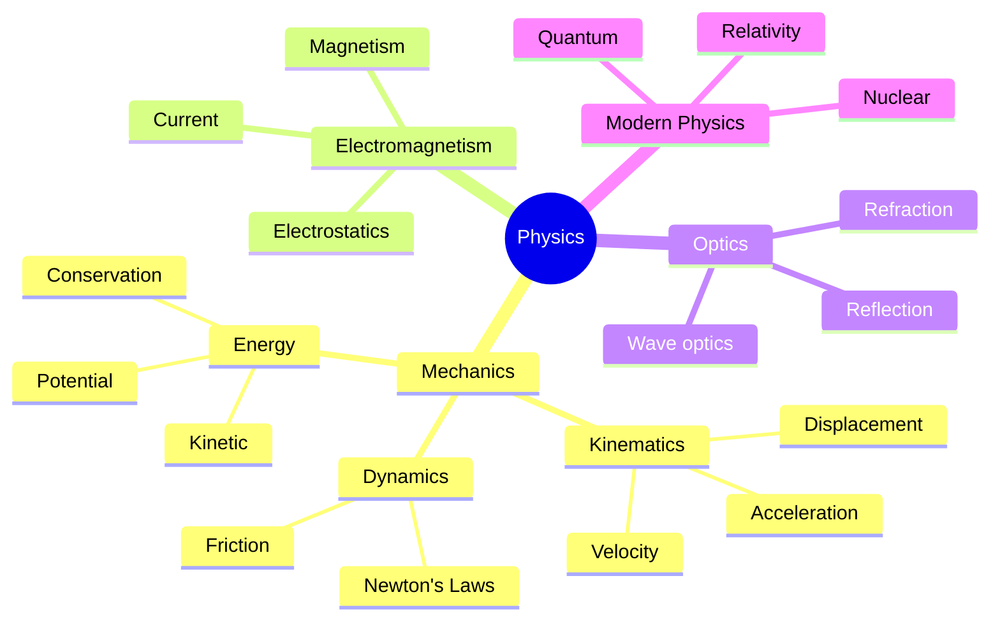

### Example — Study Plan Mindmap
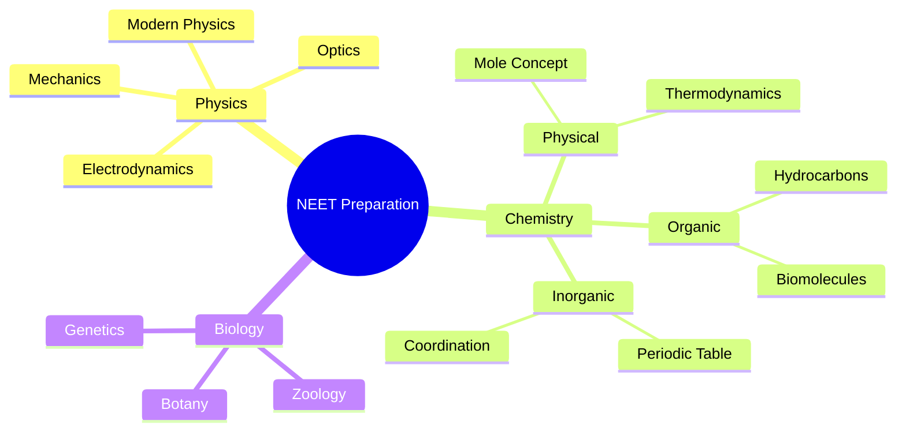

---

## 4. CLASS DIAGRAMS

### Basic Syntax
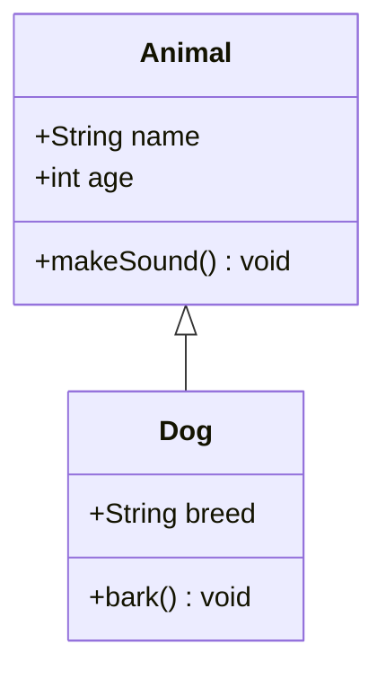

### Visibility Modifiers
```
+ public
- private
# protected
~ package/internal
* abstract
$ static
```

### Relationship Types
```
<|--      # Inheritance (child → parent)
*--       # Composition (part-of, strong)
o--       # Aggregation (has-a, weak)
-->       # Association (uses)
--        # Link (solid)
..>       # Dependency (uses temporarily)
..|>      # Realization (implements)
..        # Link (dashed)
```

### Cardinality/Multiplicity
```
"1" --> "0..1"   # exactly 1 to zero-or-one
"1" --> "*"      # exactly 1 to many
"0..1" --> "1..*" # zero-or-one to one-or-many
```

### Annotations
```
<<Interface>>
<<Abstract>>
<<Service>>
<<Enumeration>>
```

### Namespaces
```
namespace Base {
    class Animal
}
namespace Derived {
    class Dog
}
```

### Example — Biology Classification
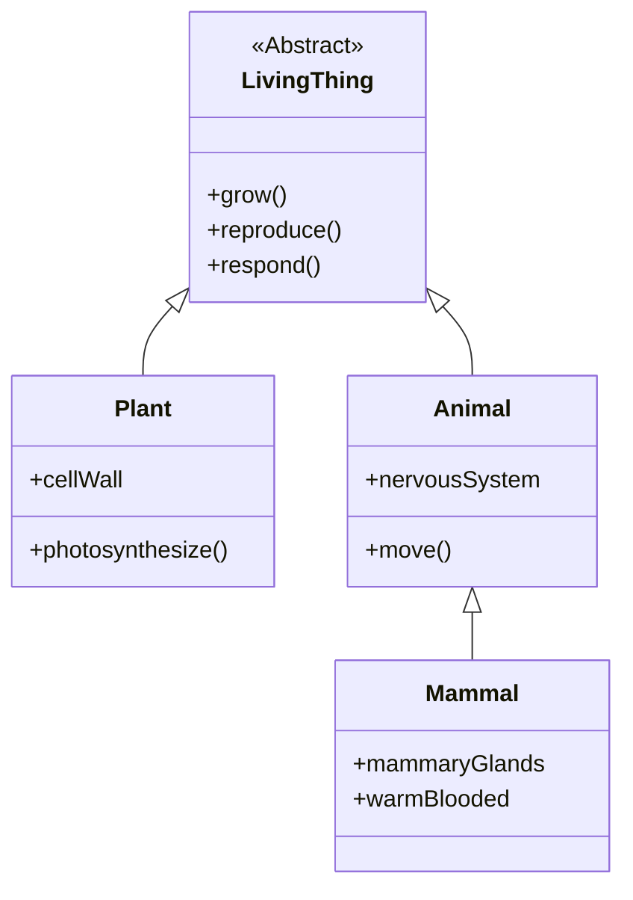

### Example — Physics Formula Relationships
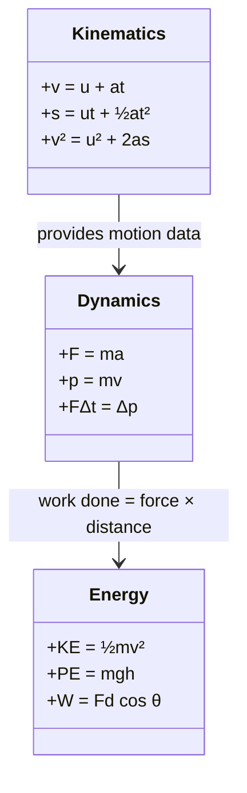

---

## 5. STATE DIAGRAMS

### Basic Syntax
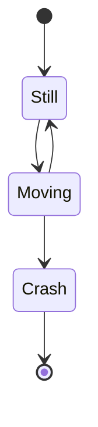

### State with Description
```
state "Very Hot" as Hot
state "Still State" as Still
```

### Composite States
```
state Active {
    [*] --> Idle
    Idle --> Processing
    Processing --> Done
    Done --> [*]
}
```

### Transitions with Text
```
Idle --> Processing: Start
Processing --> Done: Complete
Processing --> Error: Fail
```

### Choice (Branching)
```
state Choice <<choice>>
Start --> Choice
Choice --> PathA: Option 1
Choice --> PathB: Option 2
```

### Fork/Join
```
state fork <<fork>>
state join <<join>>
```

### Concurrency (using --)
```
state Active {
    [*] --> First
    --
    [*] --> Second
}
```

### Notes
```
note right of StateName: Text note
note left of StateName: Text note
```

### Example — User Authentication Flow
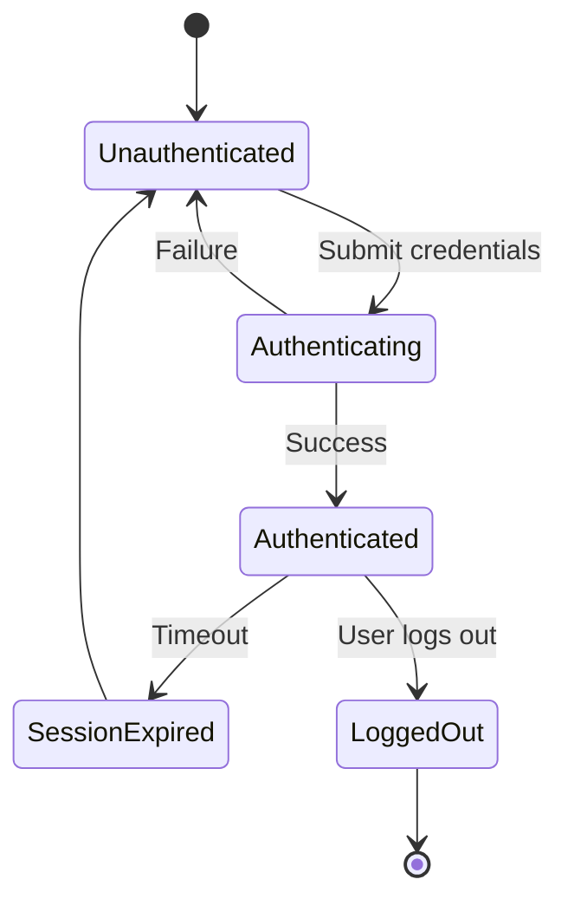

---

## 6. GIT GRAPHS

### Basic Syntax
```mermaid
gitgraph
    commit
    commit
    branch develop
    checkout develop
    commit
    commit
    checkout main
    merge develop
```

### Commit Attributes
```
commit id: "custom-id"
commit type: HIGHLIGHT
commit type: REVERSE
commit tag: "v1.0"
commit id: "abc" type: HIGHLIGHT tag: "release"
```

### Branching & Merging
```
branch feature-x
checkout feature-x
commit
checkout main
commit
merge feature-x

# Cherry-pick from another branch
cherry-pick id: "commit-id"
```

### Example — Git Flow
```mermaid
gitgraph
    commit id: "init"
    commit id: "setup"
    branch develop
    checkout develop
    commit id: "feat1"
    branch feature/login
    checkout feature/login
    commit id: "login-ui"
    commit id: "login-api"
    checkout develop
    merge feature/login
    commit id: "fix-bug"
    checkout main
    merge develop tag: "v1.0"
```

---

## 7. ENTITY RELATIONSHIP DIAGRAMS

### Basic Syntax
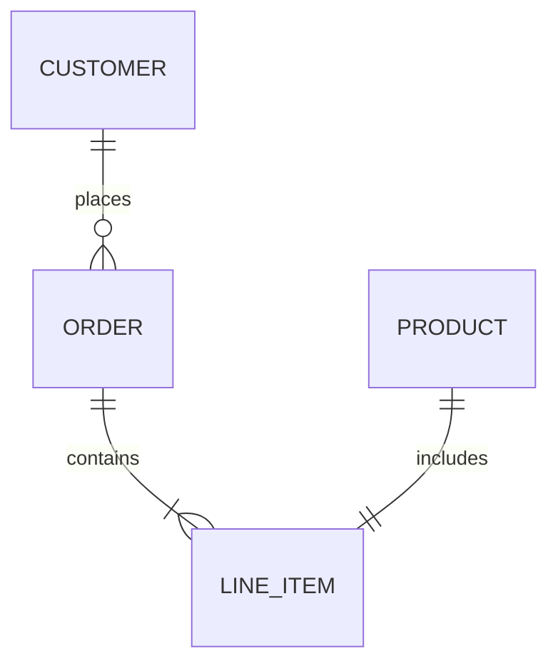

### Cardinality
```
|o     # Zero or one (optional side)
||     # Exactly one
}o     # Zero or more (many side with optional)
}|     # One or more (many side)
o{     # Zero or more (many side)
|{     # One or more (many side)
```

### Entity Attributes (optional)
```
CAR {
    string model
    int year
    string color
}
```

### Example — Student Database
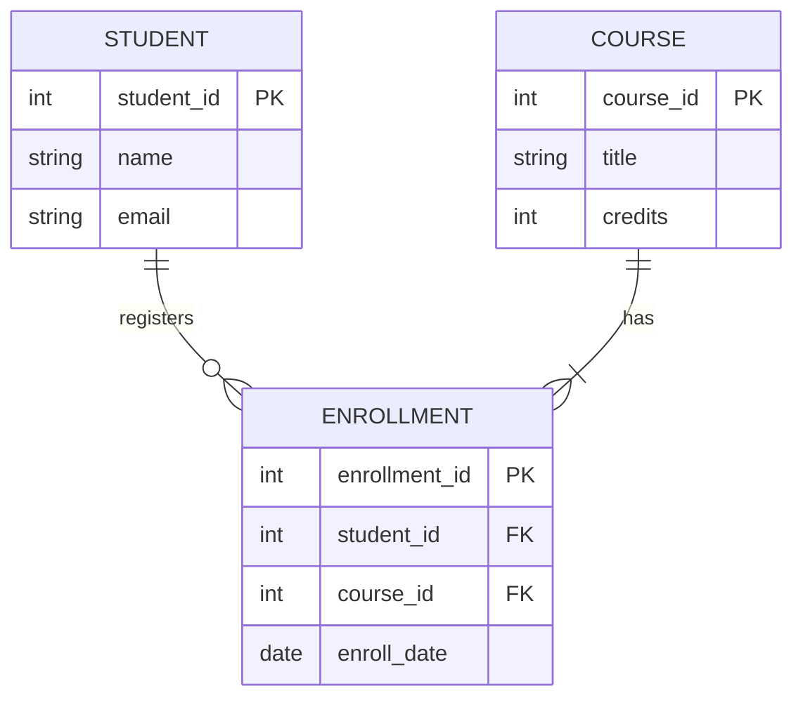

---

## 8. GANTT CHARTS

### Basic Syntax
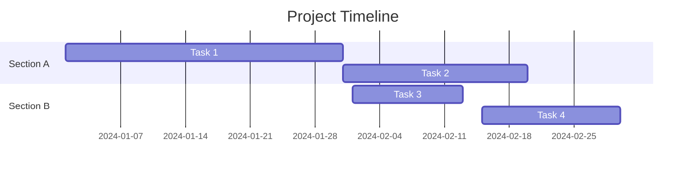

### Format Options
```
dateFormat YYYY-MM-DD    # Use standard date format
axisFormat %m/%d         # Axis label format
```

### Task Status
```
Task :active, 2024-01-01, 30d    # Active/current
Task :done, 2024-01-01, 30d      # Completed
Task :crit, 2024-01-01, 30d      # Critical path
Task :crit, active, 2024-01-01, 30d  # Combined
```

### Example — Study Schedule
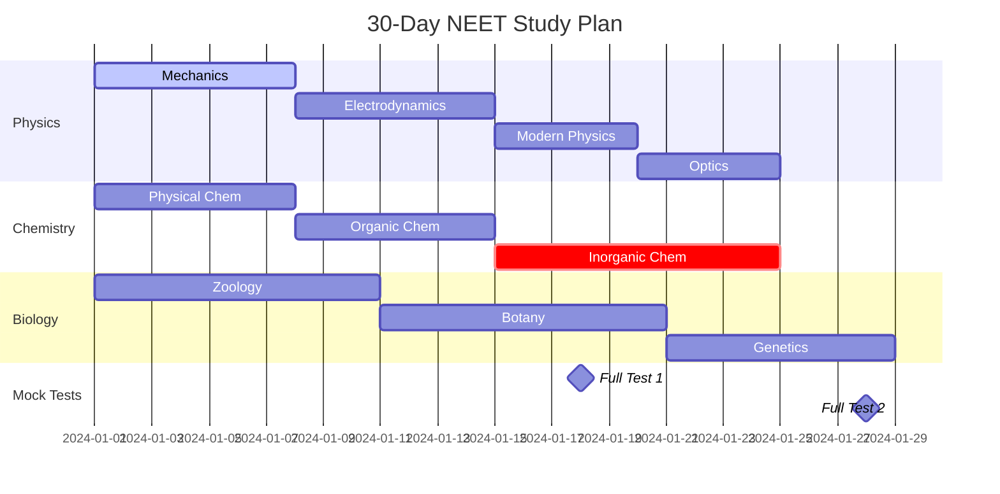

---

## 9. PIE CHARTS

### Basic Syntax
```mermaid
pie
    title Distribution
    "Category A" : 40
    "Category B" : 25
    "Category C" : 20
    "Category D" : 15
```

### Example — NEET Weightage
```mermaid
pie
    title NEET Physics Weightage
    "Mechanics" : 25
    "Electrodynamics" : 20
    "Modern Physics" : 15
    "Optics" : 12
    "Thermodynamics" : 10
    "SHM & Waves" : 8
    "Others" : 10
```

---

## 10. TIMELINE

### Basic Syntax
```mermaid
timeline
    title History of Physics
    5th century BC : Democritus proposes atoms
    1687 : Newton's Principia
    1865 : Maxwell's equations
    1905 : Einstein's relativity
    1920s : Quantum mechanics
```

### Sections
```mermaid
timeline
    title Historical Timeline
    section Ancient
        300 BC : Euclidean geometry
    section Renaissance
        1543 : Copernicus heliocentric model
        1609 : Kepler's laws
    section Modern
        1687 : Newton's laws
```

---

## 11. USER JOURNEY

### Basic Syntax
```mermaid
journey
    title Student Study Session
    section Morning
        Wake up: 3: Me
        Review notes: 5: Me
    section Afternoon
        Practice problems: 4: Me, Tutor
        Take test: 3: Me
    section Evening
        Analyze mistakes: 5: Me, Tutor
        Plan next day: 4: Me
```

---

## 12. QUADRANT CHART

### Basic Syntax
```mermaid
quadrantChart
    title Study Priority Matrix
    x-axis "Low Urgency" --> "High Urgency"
    y-axis "Low Importance" --> "High Importance"
    quadrant-1 "Do First"
    quadrant-2 "Schedule"
    quadrant-3 "Delegate"
    quadrant-4 "Delete"
    "Next Week's Quiz": [0.8, 0.9]
    "Review Old Notes": [0.3, 0.4]
    "Current Chapter HW": [0.6, 0.7]
    "Optional Reading": [0.2, 0.3]
```

---

## 13. XY CHART

### Basic Syntax
```mermaid
xychart-beta
    title "Velocity vs Time"
    x-axis "Time (s)" --> 10
    y-axis "Velocity (m/s)" --> 50
    line [0, 10, 20, 30, 40, 50]
    bar [5, 8, 12, 15, 18, 22]
```

---

## COMMON MISTAKES & SOLUTIONS

### 1. "end" breaks parsing
❌ `A[Send data] --> B[end]`
✅ `A[Send data] --> B[End]`
✅ `A[Send data] --> B[END]`

### 2. "o" as first letter creates circle edge
❌ `A---oB`
✅ `A--- oB` (space before o)
✅ `A---Object` (capital O)

### 3. Missing diagram type keyword
❌ ```` ``` ```` (just code with no type)
❌ ```` ```mermaid A--B ```` (missing graph/flowchart keyword)
✅ ```` ```mermaid graph LR; A-->B ````

### 4. Mindmap indentation errors
❌ Mixed tab/space indentation
❌ No consistent parent-child relationship
✅ Use 2-space or 4-space consistently
✅ Every child MUST be indented more than its parent
✅ Siblings MUST have the same indentation

### 5. Forgetting to close subgraphs / loops
❌ `subgraph Title ... end` missing
❌ `loop ... ` missing `end`
✅ Always close with `end`

### 6. Special characters in labels
Use quotes for special characters:
❌ `A[Text with (parentheses)]` — parentheses can confuse parser
✅ `A["Text with (parentheses)"]`

### 7. Long text overflowing nodes
Use `<br/>` for line breaks in nodes:
✅ `A["Line 1<br/>Line 2<br/>Line 3"]`
Or use markdown strings:
✅ `A["`Multi-line
text that
auto-wraps`"]`

---

## BEST PRACTICES FOR EDUCATIONAL DIAGRAMS

### Flowcharts (most common for education)
- Use `graph TD` for vertical flow (concept hierarchies, processes, decision trees)
- Use `graph LR` for horizontal comparisons, timelines, side-by-side flows
- Use diamond nodes `{ }` for decision points or questions
- Use round nodes `( )` for start/end states
- Use database nodes `[( )]` for storage/data concepts

### Mindmaps (best for concept overviews)
- Start with the main topic as the root
- Branch to major subtopics (level 1)
- Sub-branch to details (level 2+)
- Use circle shape for the root: `((Topic Name))`
- Keep node text short (2-5 words) — long text breaks mindmap layout

### Sequence Diagrams (best for processes)
- Use for showing step-by-step workflows
- Use `activate/deactivate` to show processing time
- Use `alt/else` for conditional flows
- Use `loop` for repeating processes
- Use `Note over` for annotations

### Class Diagrams (best for relationships)
- Use for showing formula dependencies
- Use for showing hierarchy (inheritance)
- Use `<<Abstract>>` for abstract/base concepts
- Use cardinality for quantitative relationships

### Keep diagrams focused
- One diagram = one concept
- Max 15-20 nodes per diagram (Kroki limitations)
- Avoid nested subgraphs (they often fail rendering)
- Use comments `%%` to mark sections in complex diagrams

### Most reliable diagram types (tested with Kroki)
1. **Graph/Flowchart** — most reliable, all features work
2. **Sequence Diagram** — very reliable
3. **Mindmap** — works in Kroki v0.9+
4. **Class Diagram** — reliable for basic relationships
5. **State Diagram** — reliable
6. **Pie Chart** — simple and always works
7. **Timeline** — works well
8. **Git Graph** — works but complex merges may fail
9. **ER Diagram** — reliable
10. **Gantt Chart** — works with simple date formats
